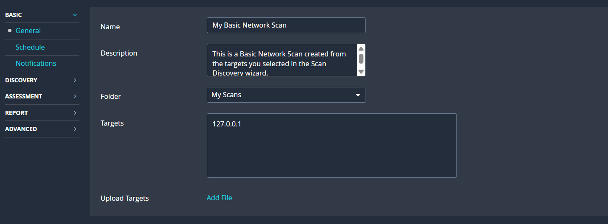

# Yash-Walhekar-Cyber-Task-3

This repository documents the completion of Task 3, which involves performing a basic vulnerability scan on a local machine.

### 1. Objective
To use a free vulnerability scanning tool (Nessus Essentials) to identify common vulnerabilities on a local PC and document the findings in a clear report.

### 2. Scan Configuration
The scan was configured using the "Basic Network Scan" template in Nessus.

* **Tool:** Tenable Nessus Essentials
* **Target:** `127.0.0.1` (localhost)
* **Scan Policy:** Basic Network Scan
* **Authentication:** The scan was unauthenticated.

*(Screenshot of the scan configuration)*

### 3. Scan Summary
The scan completed successfully and identified **21 total issues**. No 'Critical' or 'High' severity vulnerabilities were found.

* **Scan Start:** Sunday, 26 Oct 2025, 11:44 PM
* **Scan End:** Sunday, 26 Oct 2025, 11:51 PM
* **Elapsed Time:** 7 minutes

**Vulnerability Breakdown:**
* **Critical:** 0
* **High:** 0
* **Medium:** 1 
* **Low:** 0 
* **Info:** 20 *(Inferred from total)*

*(Screenshot of the scan results dashboard)*

### 4. Key Finding (Medium Severity)
The scan's most significant finding was one 'Medium' severity vulnerability.

* **Vulnerability:** SSL Certificate Cannot Be Trusted 
* **Severity:** **Medium**
* **CVSS v3.0 Score:** 6.5 
* **Description:** The service is using an SSL certificate that is not trusted. This can be because it is self-signed, expired, or signed by an unknown authority. This prevents verification of the server's identity and could allow a man-in-the-middle attack.
* **Solution:** Purchase or generate a proper, trusted SSL certificate for this service.

*(Screenshot of the detailed vulnerability)*

### 5. Task Deliverables
All required deliverables are contained within this repository:

1. **Full Scan Report (PDF):** 

### 6. Key Learnings from the Task
This assignment helped gain a real world experience in the analysis of vulnerability report. The scan result presented was 0 Critical and 0 High vulnerabilities which reflected the well-maintained and hardened system. The first and most notable finding was a Medium severity issue, "SSL Certificate Cannot Be Trusted" that is the frequent and low-risk finding of local services that use self-signed certificates. The scan would also give comprehensive "Informational" information, showing how scanners are carried out to find out how services and operating systems are located and execute before revealing any weakness.
